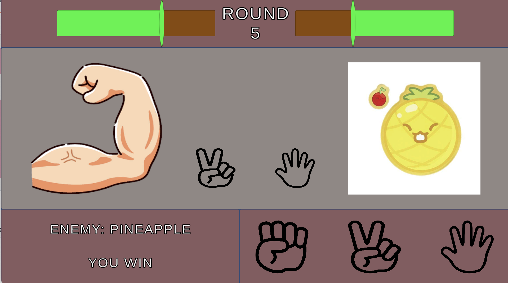

# GLICO FIGHTER

## 概要

本作は、「グリコ・チョコレート・パイナップル」のルールを用いたじゃんけんゲームと、HPバー形式の対戦ゲームを組み合わせたバトルゲームです。

プレイヤーは対戦相手とじゃんけんを行い、勝利した場合は出した手に応じたダメージを相手に与えます。
先に相手のHPを0にしたプレイヤーの勝利となります。

また、対戦相手はイージー・ノーマル・ハードの3段階から選択可能で、難易度に応じたゲームプレイが可能です。

## 操作方法

* マウスクリックで出す手を選択

## 使用技術

* Unity
* C#

## 工夫した点

* **既存ルールの組み合わせによるゲーム性の拡張**
  じゃんけん（グリコゲーム）のルールとHP制の対戦ゲームを組み合わせることで、シンプルながら戦略性のあるゲーム体験を実現しました。

* **視覚的に分かりやすいフィードバック**
  攻撃時にはキャラクターがアクションを行い、被ダメージ時には点滅する演出を加えることで、プレイヤーに状況が直感的に伝わるよう工夫しました。

* **難易度選択によるリプレイ性の向上**
  AIの強さを3段階で設定することで、プレイヤーの習熟度に応じて繰り返し楽しめる設計としました。

## スクリーンショット

## プレイ動画

（ここに動画リンクを追加）
